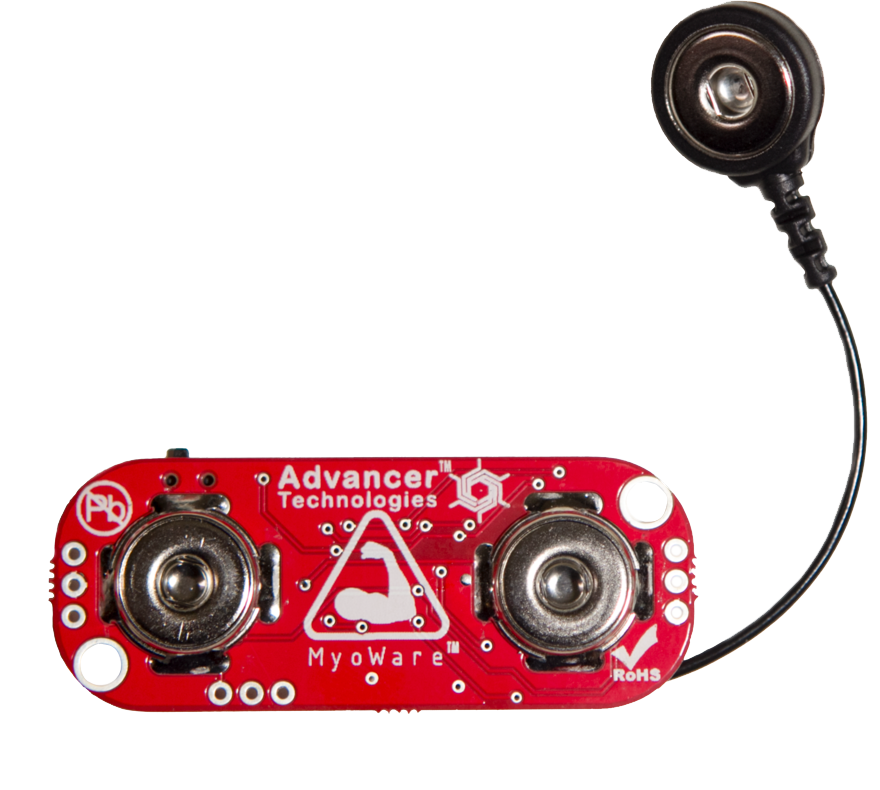
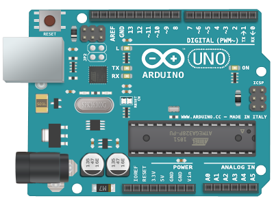
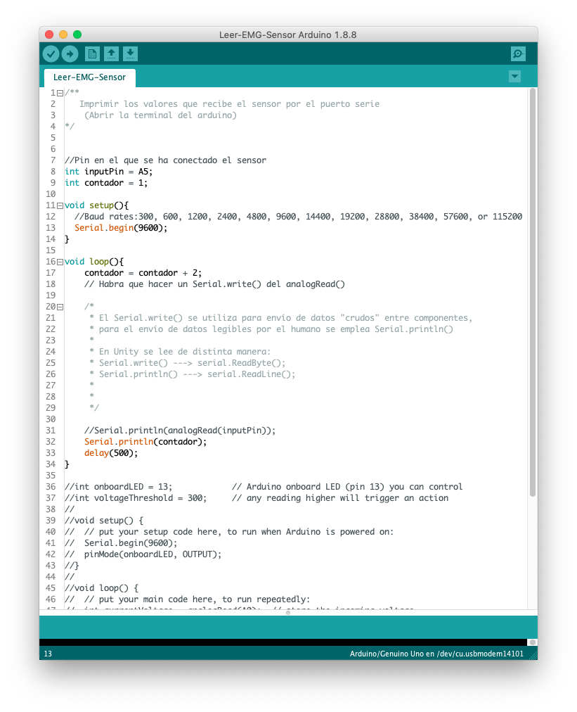
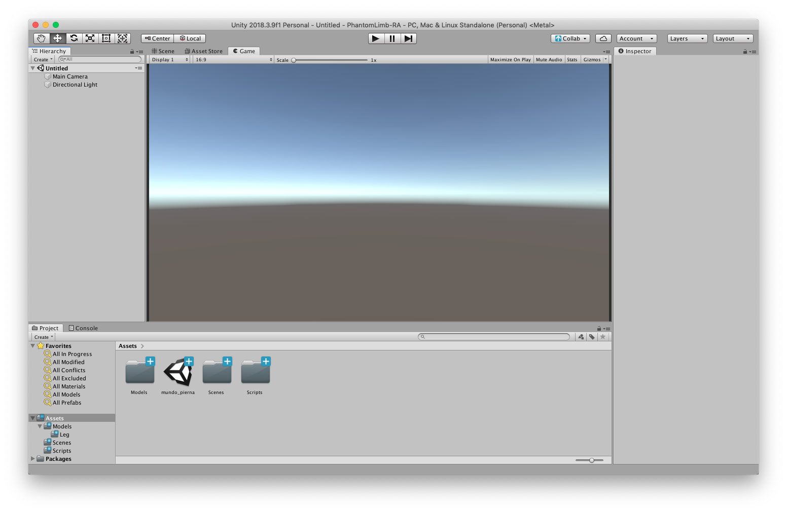
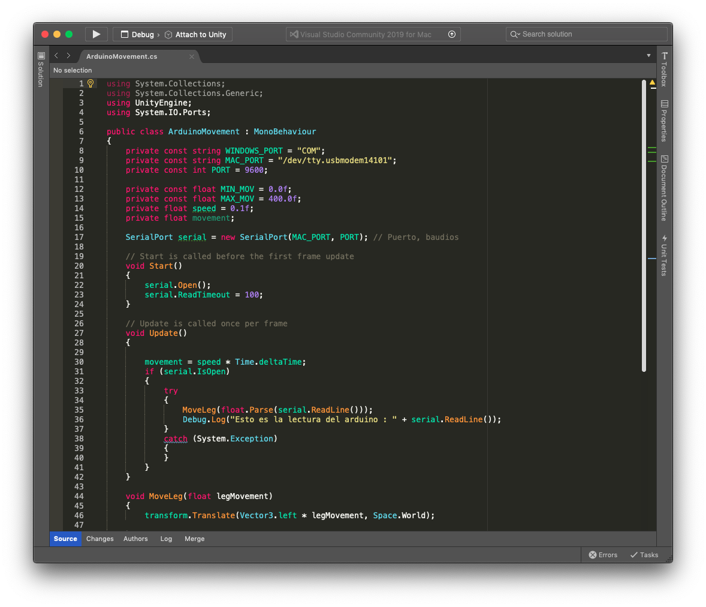

# Phantom Limb
<!-- .slide: data-background-video="https://cdn.flixel.com/flixel/40znjlquy1t6aux32ycs.tablet.mp4" data-background-video-loop="loop" data-background-video-muted -->
---
# ¿Quiénes somos?

    

        Alberto Mareca
      
  

  

    Guillermo Sesé
      
  

Note: Mi estructura pensada es: equipo - motivo - idea/proyecto - manual de uso - herramientas utilizadas (GIFs/Videos/Funcionamiento) - viabilidad - planes - fin
---
# Nuestro proyecto
<!-- .slide: data-background-video="https://cdn.flixel.com/flixel/yh4hh7nevbdxewyuuxiy.tablet.mp4" data-background-video-loop="loop" data-background-video-muted -->
----
## ¿Qué es el miembro fantasma?

Note: * **Sensación** que tiene el paciente al sufrir una amputación.
* Producido por las **neuronas espejo** del cerebro.
----
## ¿Qué hemos hecho?

Note: * La idea es aplicar la **tecnología** a una técnica *"tradicional"*. 
* Fomentar la **recuperación** del paciente mediante **juegos**.
---
<h1 style="color: #272822">HERRAMIENTAS</h1>
<!-- .slide: data-background-video="https://cdn.flixel.com/flixel/imw4b2wdt87wnj4h863h.tablet.mp4" data-background-video-loop="loop" data-background-video-muted -->
----
## Electrónica
<!-- .slide: data-background-video="https://cdn.flixel.com/flixel/ts1p4x68ezcwbofpgaw2.tablet.mp4" data-background-video-loop="loop" data-background-video-muted -->
----
<h3>Sensores MyoWare</h3>

----
<h3>Arduino UNO</h3>

----
<h3>Lenguaje C</h3>

----
<h1 style="color: #272822; text-shadow: -1px -1px 250px #FFF, 1px -1px 250px #FFF, -1px 1px 250px #FFF, 1px 1px 250px #FFF;">
  DISEÑO</h1>
<!-- .slide: data-background-video="https://cdn.flixel.com/flixel/epccdlfutqekbws2yszf.tablet.mp4" data-background-video-loop="loop" data-background-video-muted -->
----
<h3>Blender</h3>

----
<h3>Unity</h3>

----
<h3>C#</h3>

---
<h1 style="color: white; text-shadow: -1px -1px 300px #000, 1px -1px 300px #000, -1px 1px 300px #000, 1px 1px 300px #000;">
  FUNCIONAMIENTO</h1>
<!-- .slide: data-background-video="https://cdn.flixel.com/flixel/eb8823rs4soz8p6hdmpl.tablet.mp4" data-background-video-loop="loop" data-background-video-muted -->
----
## Lectura de datos
<!-- .slide: data-background-video="https://cdn.flixel.com/flixel/7a0iejyutuuc9p8rdss3.tablet.mp4" data-background-video-loop="loop" data-background-video-muted -->
----
### Sensor muscular
</img>
Note: Hacer gif de: https://youtu.be/TW4uw5EmYKQ?t=131
----
### Arduino
</img>
Note: Hacer gif de: https://youtu.be/8t-eQIotF5E?t=90
----
### Conexión al PC
</img>
Note: Otros gifs: https://giphy.com/search/plugging-usb
----
<h2 style="color: white; text-shadow: -1px -1px 125px #000, 1px -1px 125px #000, -1px 1px 125px #000, 1px 1px 125px #000;">
  APLICACIÓN</h2>
<!-- .slide: data-background-video="https://cdn.flixel.com/flixel/esylem7anpznfzxbcul2.tablet.mp4" data-background-video-loop="loop" data-background-video-muted -->
----
<table>
  <tr>
    <td style="text-align: center; border: 0;">
      Menú inicial
      </img>
    </td>
    <td style="text-align: center; border: 0;">
      Menú ajustes
      </img>
    </td>
  </tr>
  <tr>
    <td style="text-align: center; border: 0;">
      Modo entreno
      </img>
    </td>
    <td style="text-align: center; border: 0;">
      Modo libre
      </img>
    </td>
  </tr>
</table>
Note: Remarcar que es una aplicación **principalmente** hecha para PC.
---
<h1 style="color: #272822; margin-top: -200px;">¿Dudas?</h1>
<!-- .slide: data-background-video="https://cdn.flixel.com/flixel/5363uhabodwwrzgnq6vx.tablet.mp4" data-background-video-loop="loop" data-background-video-muted -->
---
<h2 style="color: white; text-shadow: -1px -1px 25px #000, 1px -1px 25px #000, -1px 1px 25px #000, 1px 1px 25px #000;">MUCHAS GRACIAS</h2>

  
Guillermo Sesé
    
      
      <a style="text-decoration: underline; color: #FFF;" href="https://github.com/ekzGuille/" target="_blank">ekzGuille</a> 
    
  

  
Alberto Mareca
    
      
      <a style="text-decoration: underline; color: #FFF;" href="https://github.com/Ag3nte/" target="_blank">Ag3nte</a> 
    
  

  

    
      
      <a style="text-decoration: underline; color: #FFF;" href="https://github.com/ekzGuille/PhantomLimb-RA" target="_blank">Proyecto en Github</a>
    
  

<!-- .slide: data-background-video="https://cdn.flixel.com/flixel/6lg4grqag3u8qciyk7p8.tablet.mp4" data-background-video-loop="loop" data-background-video-muted -->