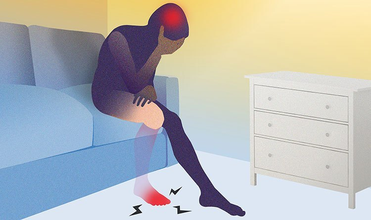

# Phantom Limb
<!-- .slide: data-background-video="https://cdn.flixel.com/flixel/40znjlquy1t6aux32ycs.hd.mp4" data-background-video-loop="loop" data-background-video-muted -->
---
# ¿Quiénes somos?

    

        Alberto Mareca
      
  

  

    Guillermo Sesé
      
  

Note: **Estudiantes** del Grado Superior y **trabajadores** de Deloitte.
---
# Nuestro proyecto
<!-- .slide: data-background-video="https://cdn.flixel.com/flixel/yh4hh7nevbdxewyuuxiy.hd.mp4" data-background-video-loop="loop" data-background-video-muted -->
Note: La idea surge de un TFG del área de *fisioterapia* para la **Universidad San Jorge**.
----
## ¿Qué es el miembro fantasma?

Note: * **Sensación** que tienen **algunos** pacientes al sufrir una amputación.
*  El dolor se manifiesta como **presión, picazón, calambres, quemaduras, choque eléctrico, roces, arañazos, puñaladas** y otros términos difíciles de explicar.
----
## ¿Qué terapia se emplea?

Note: * Técnica del **espejo**.
* Engañando a las **neuronas espejo** del cerebro. *(Estas neuronas son las que nos permiten __imitar emociones, gestos, etc__)*
----
## ¿Qué hemos hecho?
Note: * La idea es aplicar las **nuevas tecnologías** a una técnica *"tradicional"*. 
* Llevar a un **entorno virtual** el **entorno tradicional**.
* Fomentar la **recuperación** del paciente mediante **juegos**.
---
<h1 style="color: #272822">HERRAMIENTAS</h1>
<!-- .slide: data-background-video="https://cdn.flixel.com/flixel/imw4b2wdt87wnj4h863h.hd.mp4" data-background-video-loop="loop" data-background-video-muted -->
Note: Se van a indicar **dos áreas** de trabajo:
* La **electrónica**
* El **diseño 3D**
----
## Electrónica
<!-- .slide: data-background-video="https://cdn.flixel.com/flixel/ts1p4x68ezcwbofpgaw2.hd.mp4" data-background-video-loop="loop" data-background-video-muted -->
Note: Se engloba en *electrónica* todo aquello relacionado a la **obtención de datos** y tratamiento de estos.
**IMPORTANTE MENCIONAR:** Las **herramientas de software** y elementos utilizados son **todas gratuitas** (o versiones gratuitas de estas)

----
<h3>Sensores MyoWare</h3>

Note: * De **pequeño tamaño**. 
* Permiten tratar los datos en *crudo*.
* Se les puede introducir cables de electrodos **externos**.
----
<h3>Arduino UNO</h3>

Note: Microcontrolador **muy popular** y de **bajo coste** con entradas/salidas analógicas y digitales.
----
<h3>Lenguaje C</h3>

Note: **NO** es **C** como tal, sino archivos con extensión **.ino** que están basados en C.
----
<h1 style="color: #272822; text-shadow: -1px -1px 250px #FFF, 1px -1px 250px #FFF, -1px 1px 250px #FFF, 1px 1px 250px #FFF;">
  DISEÑO</h1>
<!-- .slide: data-background-video="https://cdn.flixel.com/flixel/epccdlfutqekbws2yszf.hd.mp4" data-background-video-loop="loop" data-background-video-muted -->
Note: Se engloba en *diseño* todo aquello relacionado con **mostrar información** en pantalla.
----
<h3>Blender</h3>

Note: Se utilizó para añadir **_cuerpo_ (rig)** al asset 3D que ya se tenía.
----
<h3>Unity</h3>

Note: Motor gráfico. Utilizada *versión personal*.
----
<h3>C#</h3>

Note: Programado con Visual Studio (perteneciente a Microsoft) en su *versión Community*.
---
<h1 style="color: white; text-shadow: -1px -1px 100px #000, 1px -1px 100px #000, -1px 1px 100px #000, 1px 1px 100px #000;">
  FUNCIONAMIENTO</h1>
Note: Se explicará tanto el funcionamiento **electrónico** como el funcionamiento del apartado de **diseño**.
<!-- .slide: data-background-video="https://cdn.flixel.com/flixel/eb8823rs4soz8p6hdmpl.hd.mp4" data-background-video-loop="loop" data-background-video-muted -->
----
## Lectura de datos
<!-- .slide: data-background-video="https://cdn.flixel.com/flixel/7a0iejyutuuc9p8rdss3.hd.mp4" data-background-video-loop="loop" data-background-video-muted -->
----
### Sensor muscular

Note: * 3 Electrodos: Medio, Fin, Referencia
  * **Medio**: En medio del músculo con la **misma dirección que éste** 
  * **Fin**: Desde el medio **hasta el final con la misma dirección**
  * **Referencia**: En un **hueso o grupo muscular ajeno** a los que se están midiendo
----
### Arduino

Note: * **Corre** el programa **continuamente** desde que ésta se enciende. 
* **Lee los datos** desde el pin al que se conecta el sensor.
* Los **envía** por el **puerto serie (USB)** al ordenador.
----
### Conexión al PC

Note: **Conectar el USB** del arduino al ordenador y **lanzar la aplicación**
----
<h2 style="color: white; text-shadow: -1px -1px 125px #000, 1px -1px 125px #000, -1px 1px 125px #000, 1px 1px 125px #000;">
  APLICACIÓN</h2>
<!-- .slide: data-background-video="https://cdn.flixel.com/flixel/esylem7anpznfzxbcul2.hd.mp4" data-background-video-loop="loop" data-background-video-muted -->
----
<table>
  <tr>
    <td style="text-align: center; border: 0;">
      Menú inicial
      
    </td>
    <td style="text-align: center; border: 0;">
      Menú ajustes
      
    </td>
  </tr>
  <tr>
    <td style="text-align: center; border: 0;">
      Modo entreno
      
    </td>
    <td style="text-align: center; border: 0;">
      Modo libre
      
    </td>
  </tr>
</table>
Note: Remarcar que es una aplicación **principalmente** hecha para PC.
El *modo libre* es el *"campo de pruebas"*, se ha centrado el desarrollo en el **apartado visual y práctico del _juego_**.
---
<h1 style="color: white; text-shadow: -1px -1px 800px #000, 1px -1px 800px #000, -1px 1px 800px #000, 1px 1px 800px #000; margin-top: -150px">Conclusiones</h1>
<!-- .slide: data-background-video="https://cdn.flixel.com/flixel/ypaoqdr7wuda8rv3dvia.hd.mp4" data-background-video-loop="loop" data-background-video-muted -->
Note: * Proyecto con ciertas dificultades:
  * Áreas desconocidas: **tema de SALUD**.
  * Ha habido que aprender bastante e informarse: **Electrónica y Diseño**.
  * Se ha sentido falta de comunicación.
---
<h1 style="color: #272822; margin-top: -200px;">¿Dudas?</h1>
<!-- .slide: data-background-video="https://cdn.flixel.com/flixel/5363uhabodwwrzgnq6vx.hd.mp4" data-background-video-loop="loop" data-background-video-muted -->
---
<h2 style="color: white; text-shadow: -1px -1px 25px #000, 1px -1px 25px #000, -1px 1px 25px #000, 1px 1px 25px #000;">MUCHAS GRACIAS</h2>

  
Guillermo Sesé
    
      
      <a style="text-decoration: underline; color: #FFF;" href="https://github.com/ekzGuille/" target="_blank">ekzGuille</a> 
    
  

  
Alberto Mareca
    
      
      <a style="text-decoration: underline; color: #FFF;" href="https://github.com/amareca/" target="_blank">Ag3nte</a> 
    
  

  

    
      
      <a style="text-decoration: underline; color: #FFF;" href="https://github.com/ekzGuille/PhantomLimb-RA" target="_blank">Proyecto en Github</a>
    
  

<!-- .slide: data-background-video="https://cdn.flixel.com/flixel/6lg4grqag3u8qciyk7p8.hd.mp4" data-background-video-loop="loop" data-background-video-muted -->
